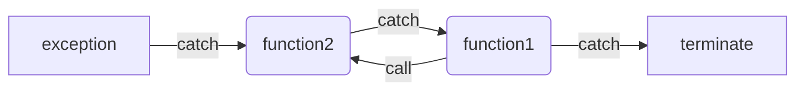

# 5.1. Simple Statements

### Null statement

<font color="blue">Advice</font>: **Null statement**s (in *0.4. Terminology*) should be commented. That way anyone reading the code can see that the statement was omitted intentionally.

# 5.2. Statement Scope

# 5.3. Conditional Statements

## 5.3.1. The `if` Statement

### dangling `else`

Curly braces can be used to effectively hide an inner `if` so that the programmer can control which `if` a given `else` should match.

## 5.3.2. The `switch` Statement

**Tips**:

- If a `switch` ends with a `default` case that has no work to do, then <u>the default label must be followed by a **null statement** or an empty block</u>.
- It's illegal to jump over an initialization if the initialized variable is in scope at the point to which control transfers.

<font color="blue">Advice</font>: If it's necessary to define and initialize a variable for a `case`, do it inside a block.

# 5.4. Iterative Statements

## 5.4.1. The `while` Statement

## 5.4.2. Traditional `for` Statement

## 5.4.3. Range `for` Statement

```c++
for (declaration : expression)
    statement
```

`expression` must be a sequence, such as a braced initializer **list**, an **array**, or an object of a type such as `string` or `vector` that has `begin` and `end` members that return **iterator**s.

## 5.4.4. The `do while` Statement

`do while` loop does not allow variable definitions inside the condition:

```c++
do
{
    cin >> n;
}
while (cin);
```

# 5.5. Jump Statements

## 5.5.1. The `break` Statement

A `break` can appear only <u>inside an iteration statement or `switch` statement</u>.

## 5.5.2. The `continue` Statement

A `continue` can appear only <u>inside a `for`, `while`, or `do while` loop</u>.

## 5.5.3. The `goto` Statement

The `goto` and the labeled statement to which it transfers control must be <u>in the same function</u>.

As with a `switch` statement, a `goto` cannot transfer control from a point where an initialized variable is out of scope to a point where that variable is in scope.

Jumping back to a point before a variable is defined destroys the variable and constructs it again.

# 5.6. `try` Blocks and Exception Handling

## 5.6.1. A `throw` Expression

```c++
#include<stdexcept>
throw runtime_error("Some info");
```

## 5.6.2. The `try` Block

```c++
try
{
    if (condition)
        throw exception_class("Some info");
}
catch (exception_class e)
{
    handler-statements;
    e.what();	// returns a copy of string
}
catch (exception-declaration)
{
    handler-statements
}
```

Rules:

- No more than one `catch` following a `try` block would be executed. 
- Suppose the function `func1` is calling `func2`. When an exception is thrown by `func2`, `func2` will be searched first for a matching `catch`. If not found, `func2` will be terminated and `func1` willed be searched for a matching `catch`, and so on, until an appropriate `catch` is found.
- If not appropriate `catch` is found, or if there are `throw`s but no `try` blocks, execution is transferred to terminate (in *0.4. Terminology*) to stop further execution.



## 5.6.3. Standard Exceptions

### Libraries

1. `<exception>`: defines **exception** `class`. It communicates only that an **exception** occurred but provides no additional information.

2. `<stdexcept>`

   | Error Type         | meaning                                                      |
   | ------------------ | ------------------------------------------------------------ |
   | `exception`        | The most general kind of problem.                            |
   | `runtime_error`    | Problem that can be detected only at run  time.              |
   | `range_error`      | Run-time error: result generated outside the  range of values that are meaningful. |
   | `overflow_error`   | Run-time error: computation that overflowed.                 |
   | `underflow_error`  | Run-time error: computation that underflowed.                |
   | `logic_error`      | Error in the logic of the program.                           |
   | `domain_error`     | Logic error: argument for which no result  exists.           |
   | `invalid_argument` | Logic error: inappropriate argument.                         |
   | `length_error`     | Logic error: attempt to create an object  larger than the maximum size for that type. |
   | `out_of_range`     | Logic error: used a value outside the valid  range.          |

3. `<new>`: defines `bad_alloc`.
4. `<type_info>`: defines `bad_cast`.

### Allowed Operations

| objects                                       | any  | exception,<br />bad_alloc,<br />bad_cast | others |
| --------------------------------------------- | :--: | :--------------------------------------: | :----: |
| create                                        |  √   |                                          |        |
| copy                                          |  √   |                                          |        |
| assign                                        |  √   |                                          |        |
| default initialize                            |      |                    √                     |        |
| initialize from a string or a  C-stype string |      |                                          |   √    |
| (function)`what()`                            |  √   |                                          |        |