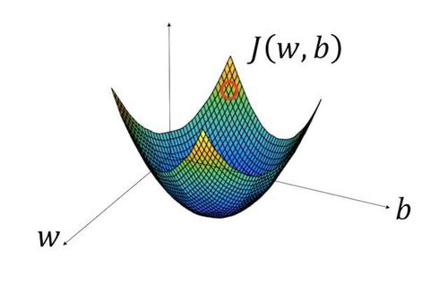

# 1. 二分分类

**单个训练样本**：$\displaystyle ( x,y) \ \ \ \ x\in \mathbb{R}^{n_{x}} ,\ y\ \in \{0,1\}$
**$m$个训练样本**： $\displaystyle \left\{\left( x^{( 1)} ,\ y^{( 1)}\right) ,\left( x^{( 2)} ,\ y^{( 2)}\right) ,\ \cdots ,\ \left( x^{( m)} ,\ y^{( m)}\right) \ \right\} ,\ m=m_{train}$
**训练集**: 
$$
\displaystyle X=\begin{bmatrix}
x^{( 1)} & x^{( 2)} & \cdots  & x^{( m)}
\end{bmatrix}, X\in \mathbb{R}^{n_{x} \times m}
$$


​		或 
$$
\displaystyle X=\begin{bmatrix}
x^{( 1)^{T}}\\
x^{( 2)^{T}}\\
\vdots \\
x^{( m)^{T}}
\end{bmatrix}, X\in \mathbb{R}^{m \times n_{x}}
$$

```python
X.shape = (nx, m)
```

 $\displaystyle Y=\left[ y^{( 1)} ,\ y^{( 2)} ,\ \cdots ,\ y^{( m)}\right] ,\ \ \ Y\in \mathbb{R}^{1\times m}$

```python
Y.shape = (1, m)
```

$\displaystyle m_{train}$: 训练样本数量
$\displaystyle m_{test}$: 测试样本数量

# 2. Logistic回归

给定$\displaystyle \ x$，希望得到$\displaystyle \ \hat{y} =P( y=1|x)$

1. 输入： $\displaystyle x\in \mathbb{R}$
2. 参数： $\displaystyle w\in \mathbb{R}^{n_{x}} ,\ b\in \mathbb{R}$
3. 输出： $\displaystyle \hat{y}$

logistic回归模型：$\displaystyle \hat{y} =\sigma \left( w^{T} x+b\right)$。令$\displaystyle z=w^{T} x+b$，则有
$$
\hat{y} =\sigma ( z) =\frac{1}{1+e^{-z}}\\
\lim _{z\rightarrow+\infty } \sigma ( z) =1\\
\lim _{z\rightarrow-\infty } \sigma ( z) =0
$$
各量的其他记法：
$$
\displaystyle x\in \mathbb{R}^{n_{x} +1} ,\ x_{0} =1\\
\hat{y} =\sigma \left( \theta ^{T} x\right) ,\ \theta =\begin{bmatrix}
\theta ^{( 1)^{T}}\\
\theta ^{( 2)^{T}}\\
\vdots \\
\theta ^{( m)^{T}}
\end{bmatrix} ,\ 其中\ \theta ^{( 1)^{T}} =b,\ \begin{bmatrix}
\theta ^{( 2)^{T}}\\
\vdots \\
\theta ^{( m)^{T}}
\end{bmatrix} =w^{T} \
$$

# 3. Logistic回归成本函数

给定训练样本$\displaystyle \left\{\left( x^{( 1)} ,\ y^{( 1)}\right) ,\left( x^{( 2)} ,\ y^{( 2)}\right) ,\ \cdots ,\ \left( x^{( m)} ,\ y^{( m)}\right) \ \right\}$，希望得到$\displaystyle \hat{y}^{( i)} \approx y^{( i)}$，其中上标$\displaystyle i$表示第$\displaystyle i$个样本。

## 1. 损失函数

​		衡量$\displaystyle w,\ b$在单个训练样本上的表现，对每一个训练样本都输出$\displaystyle y^{( i)}$，并与样本标签$\displaystyle \hat{y}^{( i)}$比较。越小越好。
$$
\displaystyle \mathcal{L}\left(\hat{y}^{( i)} ,y^{( i)}\right) =-\left[ y^{( i)}\log\left(\hat{y}^{( i)}\right) +\left( 1-y^{( i)}\right)\log\left( 1-\hat{y}^{( i)}\right)\right]
$$
​	当$\displaystyle y^{( i)} =1$时，$\displaystyle \mathcal{L}\left(\hat{y}^{( i)} ,y^{( i)}\right) =-\log\left(\hat{y}^{( i)}\right)$，要使$\displaystyle \mathcal{L}$尽可能小，则要使$\displaystyle \hat{y}^{( i)}$尽可能大；
​	当$\displaystyle y^{( i)} =0$时，$\displaystyle \mathcal{L}\left(\hat{y}^{( i)} ,y^{( i)}\right) =-\log\left( 1-\hat{y}^{( i)}\right)$，要使$\displaystyle \mathcal{L}$尽可能小，则要使$\displaystyle \hat{y}^{( i)}$尽可能小；

## 2. 成本函数

衡量$\displaystyle w,\ b$在全体训练样本上的表现。
$\displaystyle J( w,b) =\frac{1}{m}\sum ^{m}_{i=1}\mathcal{L}\left(\hat{y}^{( i)} ,y^{( i)}\right) =-\frac{1}{m}\sum ^{m}_{i=1}\left[ y^{( i)}\log\left(\hat{y}^{( i)}\right) +\left( 1-y^{( i)}\right)\log\left( 1-\hat{y}^{( i)}\right)\right]$

# 4. 梯度下降法

作用：用于习得合适的$\displaystyle w,\ b$，使得$\displaystyle J( w,b)$最小。

|                             图像                             | 计算过程                                                     |
| :----------------------------------------------------------: | :----------------------------------------------------------- |
|  | repeat{<br />         $w=w-\alpha \frac{dJ( w)}{dw}$<br />}<br />>注：编程时使用$\displaystyle dw$ 作为$\displaystyle \frac{dJ( w)}{dw}$ 的变量名 |
|  | repeat\{<br/>	$\displaystyle w=w-\alpha \frac{\partial J( w)}{\partial w}$<br/>	$\displaystyle b=b-\alpha \frac{\partial J( w)}{\partial w}$<br/>\} |

其中：$\displaystyle \alpha $为学习率（步长）

# 5. 导数

# 6. 更多导数的例子

# 7. 计算图

$\displaystyle J( a,b,c) =3( a+bc)$

令$\displaystyle u=bc$，则$\displaystyle v=a+u$，$\displaystyle J=3v$


# 8. 计算图的导数计算

$$
\displaystyle \frac{dJ}{da} =\frac{dJ}{dv} \cdot \frac{dv}{da}
$$

# 9. logistic回归中的梯度下降法

## 1. 单个样本的logistic函数
​		$\displaystyle  \begin{array}{{>{\displaystyle}l}}
z=w^{T} x+b\\
\hat{y} =a=\sigma ( z)\\
\mathcal{L}( a,y) =-( y(\log( a) +( 1-y)\log( 1-a))
\end{array}$

## 2. 计算梯度
​		$\displaystyle "da"=\frac{d\mathcal{L}( a,y)}{da} =-\frac{y}{a} +\frac{1-y}{1-a}$
​		$\displaystyle "dz"=\frac{d\mathcal{L}( a,y)}{dz} =\frac{d\mathcal{L}}{da} \cdot \frac{da}{dz} =a-y$
​		$\displaystyle \begin{aligned}
"dw_{1} " & =\frac{\partial \mathcal{L}}{\partial w_{1}} =x_{1} dz\\
"dw_{2} " & =x_{2} dz\\
"db" & =dz
\end{aligned}$

## 3. 更新权重和阈值
​		$\displaystyle \begin{aligned}
w_{1} & =w_{1} -\alpha dw_{1}\\
w_{2} & =w_{2} -\alpha dw_{2}\\
b & =b-\alpha d
\end{aligned}$

# 10. $m$个样本的梯度下降

单个样本的梯度下降即**随机梯度下降(SGD)**，多个样本的梯度下降即**平均梯度下降**。

**全局成本函数**：$\displaystyle J( w,b) =\frac{1}{m}\sum ^{m}_{i=1}\mathcal{L}\left( a^{( i)} ,y^{( i)}\right)$

​		其中，
$$
\begin{eqnarray}
&&\displaystyle a^{( i)} =\hat{y}^{( i)} =\sigma \left( z^{( i)}\right) =\sigma \left( w^{T} x^{( i)} +b\right)\\
&&\frac{\partial }{\partial w_{1}} J( w,b) =\frac{1}{m}\sum ^{m}_{i=1}\frac{\partial }{\partial w_{1}}\mathcal{L}\left( a^{( i)} ,y^{( i)}\right) =\frac{1}{m}\sum ^{m}_{i=1} "dw_{1}"
\end{eqnarray}
$$
**计算过程**（伪代码）：

>// 初始化
>
>$J=0;\ dw_{1} =0;\ dw_{2} =0;\ db=0\\$
>
>// 迭代
>
>$for\ t\ =1\ to\ n_{x} :$	// $n_{x}$为迭代次数
>
>>$for\ i\ =1\ to\ m:$
>>
>>$z^{( i)} =w^{T} x^{( i)} +b$
>>
>>$a^{( i)} =\sigma \left( z^{( i)}\right)$
>>
>>$J+=-\left[ y^{( i)}\log\left( a^{( i)}\right) +\left( 1-y^{( i)}\right)\log\left( 1-a^{( i)}\right)\right]$
>>
>>$dz^{( i)} =a^{( i)} -y^{( i)}$
>>
>>// 假设只有两个特征
>>
>>$dw_{1} +=x^{( i)}_{1} dz^{( i)}$
>>
>>$dw_{2} +=x^{( i)}_{2} dz^{( i)}$
>>
>>$db+=dz^{( i)}$
>
>$J/=m$
>
>$dw_{1} /=m;\ dw_{2} /=m;\ db/=m$
>
>// 更新参数
>
>$ w_{1} =w_{1} -\alpha dw_{1}$
>
>$w_{2} =w_{2} -\alpha dw_{2}$
>
>$b=b-\alpha d$

​		其中，$\displaystyle z^{( i)}$含有上标，因为其对应第$\displaystyle i$个训练样本的计算，而$\displaystyle dw_{1} ,\ dw_{2} ,\ db$用作累加器（最后除以$m$，得到$\displaystyle "dw_{1} "=\frac{\partial \mathcal{L}}{\partial w_{1}}$），故没有上标。

# 11. 向量化(vectorization techniques)

以计算$\displaystyle z=w^{T} x+b$为例：

- 非向量化

  ```python
  z = 0
  for i in range(n_x):
      z = z + w[i]*x[i]
  z = z + b
  ```

- 向量化

```python
z = np.dot(w, x) + b
```

​		其中$\displaystyle w,\ x\in R^{n_{x}}, b$为常数，但通过`Python`的广播机制转化为$n_x$维向量进行计算。

>`numpy`的内置函数能够使用SIMD指令来加快运算速度。

# 12. 向量化的更多例子

1. 向量$\times$矩阵：`np.dot(A,v)`
2. 向量指数运算：`np.exp(A)`
3. 对数：`np.log(v)`
4. 绝对值：`np.abs(v)`
5. 最大比较值：`np.maximum(v, 0)`（找出向量v中所有元素与0比较得到的较大的值）

# 13. 向量化logistic回归

$\displaystyle X=\begin{bmatrix}
x^{( 1)} & x^{( 2)} & \cdots  & x^{( m)}
\end{bmatrix}, X\in \mathbb{R}^{n_{x} \times m}, w\in \mathbb{R}^{n_{x}} ,\ b\in \mathbb{R}$

则
$$
\begin{align*}
Z & =\begin{bmatrix}
z^{( 1)} & z^{( 2)} & \cdots  & z^{( m)}
\end{bmatrix}\\
 & =w^{T} X+\begin{bmatrix}
b & b & \cdots  & b
\end{bmatrix}\\
 & =\begin{bmatrix}
w^{T} x^{( 1)} +b & w^{T} x^{( 2)} +b & \cdots  & w^{T} x^{( m)} +b
\end{bmatrix}
\end{align*}
$$

非向量化与向量化的logistic回归的比较见下节。

# 14. 向量化logistic回归的梯度输出

$\displaystyle A=\begin{bmatrix}
a^{( 1)} & a^{( 2)} & \cdots  & a^{( m)}
\end{bmatrix} ,\ Y=\begin{bmatrix}
y^{( 1)} & y^{( 2)} & \cdots  & y^{( m)}
\end{bmatrix}$

$\displaystyle dZ=\begin{bmatrix}
dz^{( 1)} & dz^{( 2)} & \cdots  & dz^{( m)}
\end{bmatrix}$

| 一次非向量化迭代                                             | 一次向量化迭代                             |
| ------------------------------------------------------------ | ------------------------------------------ |
| $for\ i=1\ to\ m:\\ \ \ \ \ z^{( i)} =w^{T} x^{( i)} +b$     | $z=w^{T} x\ +\ b$                          |
| $\begin{array}{l}for\ i=1\ to\ m:\\\ \ \ \ a^{( i)} =\sigma \left( z^{( i)}\right)\end{array}$ | $\displaystyle a=\sigma ( z)$              |
| $\displaystyle  \begin{array}{{>{\displaystyle}l}}for\ i=1\ to\ m:\\\ \ \ \ dz^{( i)} =a^{( i)} -y^{( i)}\end{array}$ | $\displaystyle dz=a-y$                     |
| $\displaystyle  \begin{array}{{>{\displaystyle}l}}for\ i=1\ to\ m:\\\ \ \ \ dw_{j} +=x^{( i)}_{j} dz^{( i)}\\dw_{j} /=m\end{array}$ | $\displaystyle dw=\frac{1}{m} xdz^{T}$     |
| $\displaystyle  \begin{array}{{>{\displaystyle}l}}for\ i=1\ to\ m:\\\ \ \ \ db+=dz^{( i)}\\db/=m\end{array}$ | $\displaystyle db=\frac{1}{m} np.sum( dz)$ |
| $\displaystyle  \begin{array}{{>{\displaystyle}l}}for\ i=1\ to\ m:\\\ \ \ \ w_{1} =w_{1} -\alpha dw_{1}\end{array}$ | $\displaystyle w=w-\alpha dw$              |
| $\displaystyle b=b-\alpha d$                                 | $\displaystyle b=b-\alpha d$               |

# 15. `Python`中的广播

$\displaystyle x=\begin{bmatrix}
x^{( 1)}\\
x^{( 2)}\\
\vdots \\
x^{( n)}
\end{bmatrix} ,\ A_{m\times n} ,\ c\in \mathbb{R}$，则
$\displaystyle x+c=\begin{bmatrix}
x^{( 1)}\\
x^{( 2)}\\
\vdots \\
x^{( n)}
\end{bmatrix} +\begin{bmatrix}
c\\
c\\
\vdots \\
c
\end{bmatrix}$
$\displaystyle A+x^{T.} =A+\begin{bmatrix}
x^{T}\\
x^{T}\\
\vdots \\
x^{T}
\end{bmatrix}$

# 16. 关于`Python/numpy`向量的说明

- 数组（秩$r=1$）

  ```python
  a = np.random.randn(5)
  print(a)
  '''[-0.38061691  0.64839893  0.9392231  -0.47190264 -0.87710859]'''
  print(a.shape)  '''(5,) ，即a为秩r(a)=1的数组'''
  print(np.dot(a, a.T)) '''得到一个数字，即得到向量的内积'''
  ```

- 矩阵

  ```python
  b = np.random.randn(5,1)
  print(b)
  '''[[-0.89820767],
  [-0.27581984],
  [-0.32744034],
  [-0.60529585],
  [-0.29806446]]
  '''
  print(b.shape) '''(5, 1), 即b为1times 5的矩阵（列向量）'''
  print(np.dot(b, b.T)) '''得到5times 5的矩阵，即得到向量的外积'''
  ```

# 17. Jupyter/ipython笔记本的快速指南

略

# 18. logistic损失函数的解释

## 1. 损失函数

**单个样本概率分布**：$\displaystyle p( y|x) =\left\{\begin{aligned}
\hat{y} & ,\ y=1\\
1-\hat{y} & ,\ y=0
\end{aligned}\right. $

**合并形式**：$\displaystyle p( y|x) =\hat{y}^{y}\left( 1-\hat{y}\right)^{( 1-y)}$

​		由于最大化$\displaystyle p( y|x)$等同于最大化$\displaystyle \log p( y|x)$，因此求对数并取负值得到<u>**损失函数**</u>：

交叉熵：
$$
\mathcal{L}\left(\hat{y} ,y\right) =-\log p( y|x) =-\left[ y\log\left(\hat{y}\right) +\left( 1-y\right)\log\left( 1-\hat{y}\right)\right]
$$

注意：交叉熵与同时使用LogSoftMax和NLL Loss的作用相似，因此要避免重复使用。

## 2. 成本函数

​		从最大似然角度出发，设所有样本独立同分布，则：

**样本集概率分布**：$\displaystyle P( X) =\prod ^{m}_{i=1} P\left( y^{( i)} |x^{( i)}\right)$

​		同上，得到
$$
\displaystyle \log P( X) =\sum ^{m}_{i=1}\log P\left( y^{( i)} |x^{( i)}\right) =-\sum ^{m}_{i=1}\mathcal{L}\left(\hat{y}^{( i)} ,y^{( i)}\right)
$$
​		再取平均值，得到**<u>成本函数</u>**：
$$
\displaystyle J( w,b) =\frac{1}{m}\sum ^{m}_{i=1}\mathcal{L}\left(\hat{y}^{( i)} ,y^{( i)}\right)
$$

​		最大化$\displaystyle p( y|x)$等同于最小化$J( w,b)$。

