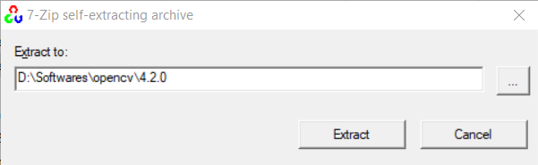
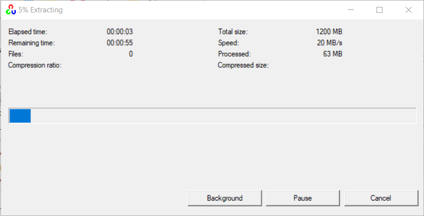
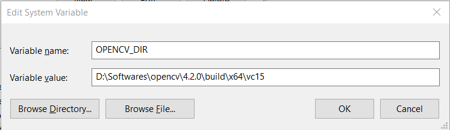
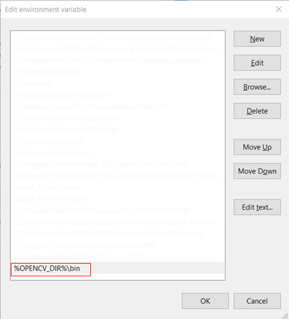
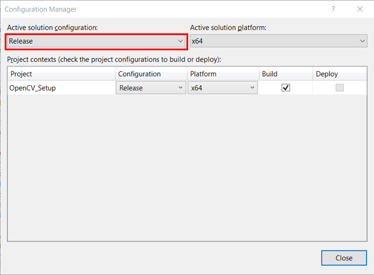
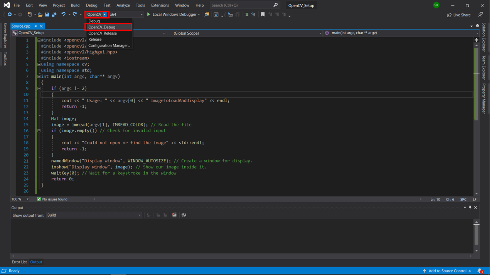
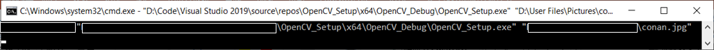
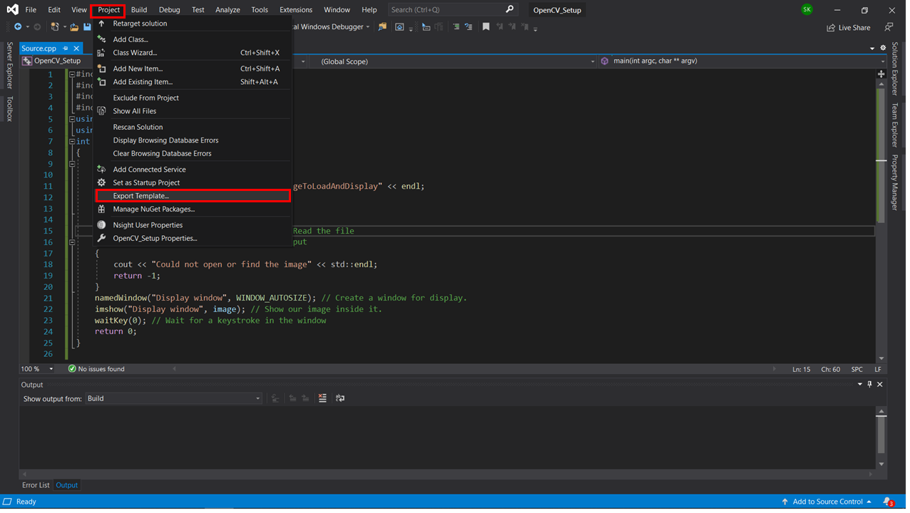
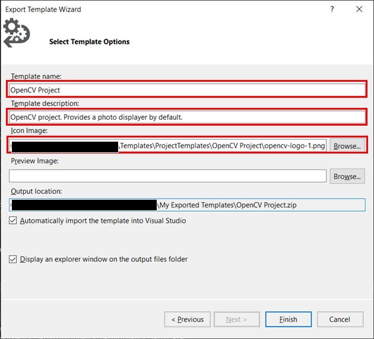
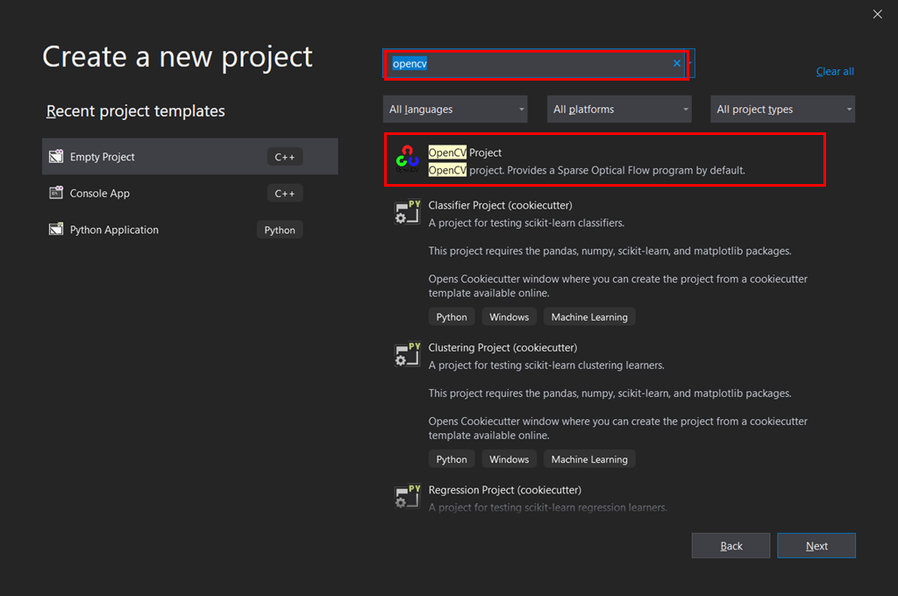

<div align="center">
    <font size="5">
    	无需复制任何文件！在Visual Studio上设置OpenCV项目最简单的教程
    </font>
</div></div>

**摘要**：本文参考官方教程写作而成，与网上大部分教程的区别是，本文所描述的方法**无需繁琐且不便于后续更改的复制文件的过程，仅仅需要设置VS项目的属性即可**。同时为了简便起见，另外**加入了设置Visual Studio模板项目**的步骤，只需从模板直接生成项目即可进行OpenCV开发。

# 第一步、下载并解压OpenCV

1. 从[官方网址](https://opencv.org/releases/)选择所需的Windows版本下载。

2. 下载完成后直接点击解压。注意<font color="red"> OpenCV解压完成即可，无需安装，因此这里需要谨慎选择解压路径</font>（当然解压完成后移动文件夹也可以，不过会麻烦一点）。建议路径如下：`要安装的目录\opencv\版本号`，例如如图所示的`D:\Softwares\opencv\4.2.0`，这样方便多版本兼容。

   

3. 点击左边的`Extract`解压，出现以下界面：



4. 解压完成后会自动退出上面的界面。这样解压出来实际上的路径是`D:\Softwares\opencv\4.2.0\opencv\...`，为了简洁美观起见，我把后面的`opencv`文件夹里面的所有文件都移动到`4.2.0`里面了。

# 第二步、添加环境变量

1. 点击`我的电脑`->`属性`->`高级系统设置`->`环境变量`，添加环境变量`OPENCV_DIR`如下（注意这里要根据自己的系统版本和Visual Studio版本设置安装路径）：



> 这是官方教程里面的版本对应路径（注意路径前面的`D:\OpenCV`要换成自己的安装路径）：
> ```powershell
> D:\OpenCV\build\x86\vc11     (Visual Studio 2012 - 32 bit Windows)
> D:\OpenCV\build\x64\vc11     (Visual Studio 2012 - 64 bit Windows)
> D:\OpenCV\build\x86\vc12     (Visual Studio 2013 - 32 bit Windows)
> D:\OpenCV\build\x64\vc12     (Visual Studio 2013 - 64 bit Windows)
> D:\OpenCV\build\x64\vc14     (Visual Studio 2015 - 64 bit Windows)
> ```

2. 随后在`path`里面添加环境变量如下：`%OPENCV_DIR%\bin`。



# 第三步、创建VS项目并新建配置

注：下面以`Visual Studio 2019`为例进行下面的设置。

1. 打开Visual Studio，创建一个空项目，并在源文件夹里面新建一个空的`c/cpp`文件。

2. 打开项目属性，点击右上角的`Configuration Manager`。


3. 点击`Release`，选择`New`。



4. 将名字改成`OpenCV_Debug`并保存。

# 第四步、设置属性

1. 打开项目属性，在`C/C++`-> `General`下的`Additional Include Directories`中填入`$(OPENCV_DIR)\..\..\include`。

 General -> Additional Include Directories" style="zoom:80%;" />

2. 接下来在`Linker` -> `General`下的`Additional Library Directories`中填入`$(OPENCV_DIR)\lib`

 General Additional Library Directories" style="zoom:80%;" />

3. 然后指出需要连接的库。在文件管理器地址栏中输入`%OPENCV_DIR%\lib`并回车，查看此目录下都有哪些`.lib`文件。

   - 如果有类似于`opencv_calib3d300d.lib`, `opencv_core300d.lib`的文件，说明你下载的opencv版本比较旧，需要分别添加这些库。

   - 如果只有类似于`opencv_world420.lib`和`opencv_world420d.lib`（上一条提到的所有库的汇总，末尾有`d`的文件表示是调试用的库）的文件，则说明你下载的opencv版本比较新，只需要添加一个库文件即可。

4. 以第二种情况为例，在`Linker` -> `Input`下的`Additional Dependencies`的最后添加`opencv_world420d.lib`（点击`Additional Dependencies`最右边向下的箭头，选择`Edit`，再输入即可）。

 Input -> Additional Dependencies" style="zoom:80%;" />

5. 点击`OK`保存，退出属性设置窗口，就完成opencv的debug设置了。
6. 接下来进行opencv的release设置。重复“第三步”的3、4，不过需要将名字改成`OpenCV_Release`。然后重复“第四步”，不过在第四步的4中需要添加末尾没有`d`的`.lib`文件，例如`opencv_world420.lib`，最后保存并退出，即完成opencv的release设置了。
7. 最后，一定要将配置选择为`OpenCV_Debug`才能编译文件。



# 第五步、测试

2. 将下面的代码复制到“第四步”的1中创建的`cpp`文件中，编译。

   ```c++
   #include <opencv2/core.hpp>
   #include <opencv2/imgcodecs.hpp>
   #include <opencv2/highgui.hpp>
   #include <iostream>
   using namespace cv;
   using namespace std;
   int main(int argc, char** argv)
   {
       if (argc != 2)
       {
           cout << " Usage: " << argv[0] << " ImageToLoadAndDisplay" << endl;
           return -1;
       }
       Mat image;
       image = imread(argv[1], IMREAD_COLOR); // Read the file
       if (image.empty()) // Check for invalid input
       {
           cout << "Could not open or find the image" << std::endl;
           return -1;
       }
       namedWindow("Display window", WINDOW_AUTOSIZE); // Create a window for display.
       imshow("Display window", image); // Show our image inside it.
       waitKey(0); // Wait for a keystroke in the window
       return 0;
   }
   ```

3. 在cmd中输入编译后的可执行文件的路径，再随便输入一张图片的路径，回车，就会看到这张图片显示在一个图片查看器中啦！

   

   

# 第六步、设置模板项目

1. 点击`项目` -> `导出模板` (`Project` -> `Export Template`)。



2. 在弹出的窗口中直接选择`下一步` (`Next`)。
3. 依次设置模板名称、描述和图标，最后点击`结束` (`Finish`)即可（点击下载[OpenCV官方图标](https://opencv.org/wp-content/uploads/2019/02/opencv-logo-1.png)）。



4. 最后打开开始界面，搜索`opencv`，可以看到我们设置的模板出现啦！后面再写opencv程序的时候只需要用这个模板创建项目就可以啦！



